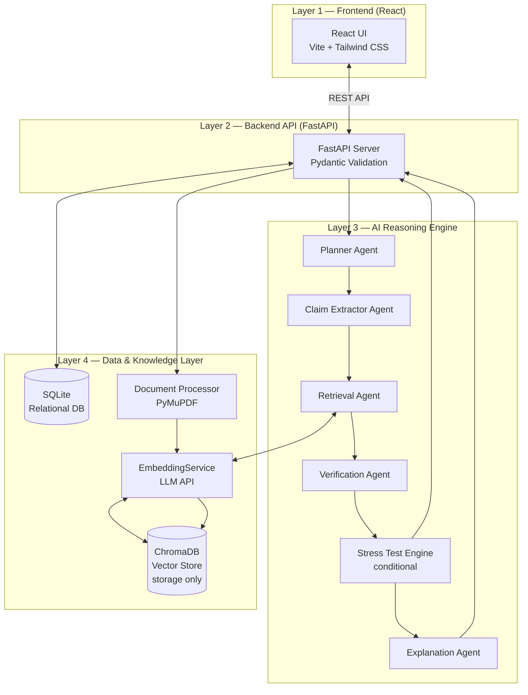
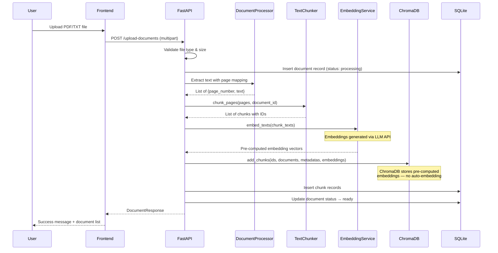
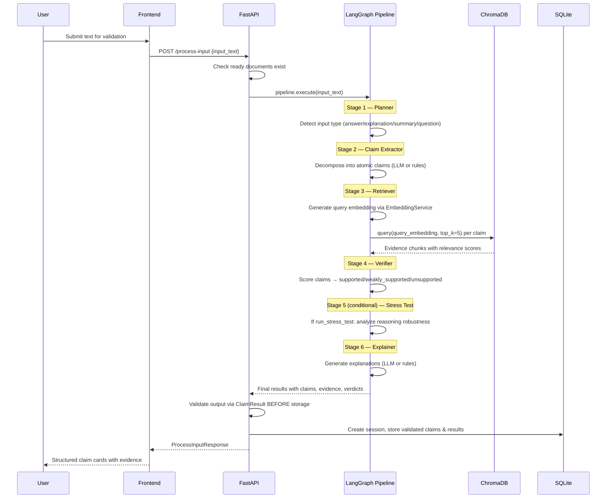
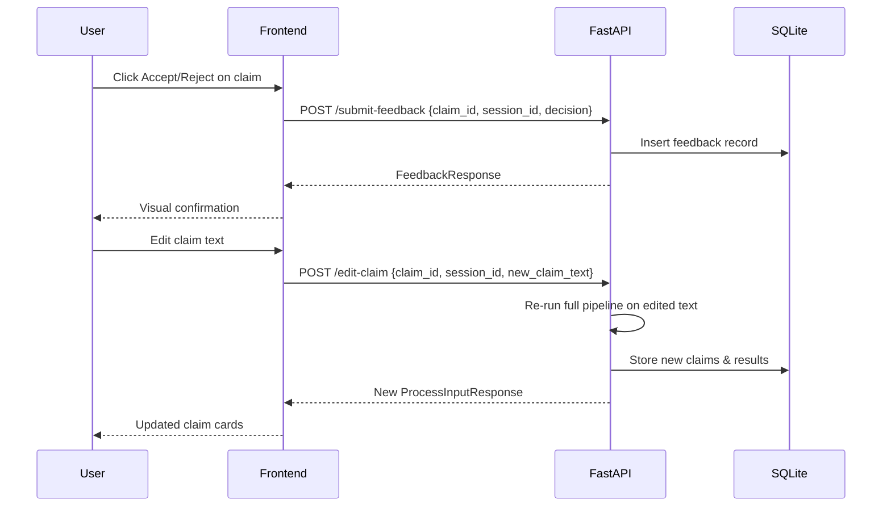
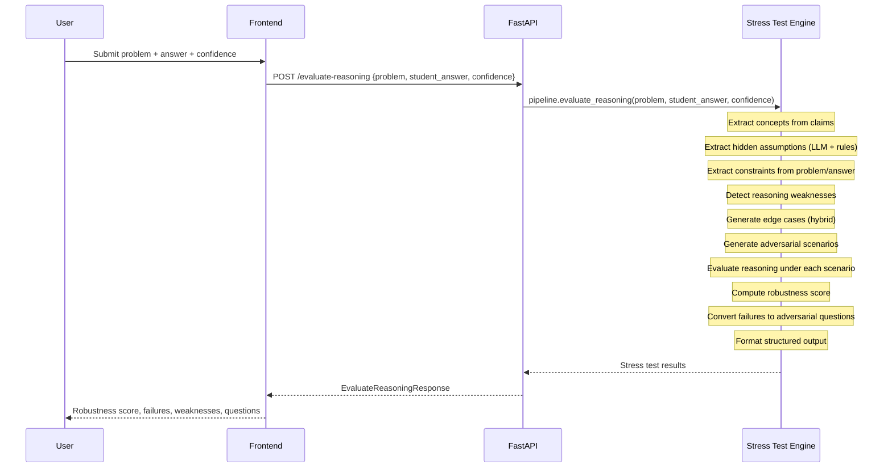
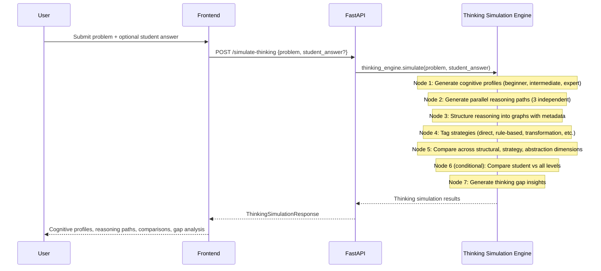

# EviLearn — Claim-Based Knowledge Validation System

> **EviLearn is NOT a chatbot.** It is a structured, evidence-based reasoning system that validates user-submitted knowledge (answers, summaries, explanations) against uploaded reference documents. Every output is traceable to document evidence.

## Core Mechanism

```
Input → Claims → Evidence → Verification → Stress Test (conditional) → Explanation
```

A user submits text. The system decomposes it into atomic claims, retrieves evidence from uploaded documents, verifies each claim against that evidence, optionally stress-tests reasoning for robustness, and generates a human-readable explanation for every verdict. No claim is accepted or rejected without document-backed reasoning.

## Thinking Simulation Engine

EviLearn includes a **Thinking Simulation Engine** — a LangGraph-based multi-agent reasoning simulator that decomposes and compares how different cognitive levels think about a problem.

### Feature Overview

The Thinking Simulation Engine does **NOT** solve problems or check correctness. It focuses exclusively on:

- **Reasoning structure** — how thinking is organized at each level
- **Strategy differences** — which approaches each level uses or misses
- **Abstraction levels** — low vs. high reasoning transitions

### Architecture (LangGraph Nodes + Flow)

```
START → Cognitive Profile Generator → Parallel Reasoning Generator
→ Reasoning Structurer → Strategy Tagger → Comparative Analyzer
→ (if student answer exists) Student Comparator → Gap Generator → END
```

All 7 nodes operate as pure functions on a shared `ThinkingState` via LangGraph `StateGraph`. The student comparator node is conditional — it only executes when a student answer is provided.

### State Design

The engine uses a central `ThinkingState` (TypedDict) containing:

| Field | Written By | Description |
|-------|-----------|-------------|
| `problem` | Input | The problem/question to analyze |
| `student_answer` | Input | Optional student reasoning |
| `cognitive_profiles` | Node 1 | Beginner, intermediate, expert profiles |
| `reasoning_paths` | Node 2 | 3 independent reasoning paths |
| `structured_graphs` | Node 3 | Structured representations with metadata |
| `strategy_tags` | Node 4 | Strategy categorizations per level |
| `comparison_results` | Node 5 | Cross-level comparison analysis |
| `student_comparison` | Node 6 | Student vs. levels comparison (conditional) |
| `gap_analysis` | Node 7 | Thinking gap insights |

### Module Descriptions

| Node | Name | Responsibility |
|------|------|---------------|
| 1 | Cognitive Profile Generator | Generates 3 distinct reasoning profiles (beginner, intermediate, expert) with enforced separation |
| 2 | Parallel Reasoning Generator | Generates 3 independent reasoning paths, each following its profile constraints |
| 3 | Reasoning Structurer | Converts reasoning paths into structured graphs with steps, decisions, and metadata |
| 4 | Strategy Tagger | Tags each path with strategy categories (direct application, rule-based, transformation, reduction, optimization) |
| 5 | Comparative Analyzer | Compares paths across structural, strategy, and abstraction dimensions |
| 6 | Student Comparator | Conditional — compares student reasoning against all three levels |
| 7 | Gap Generator | Produces strict insight outputs about thinking gaps |

### Example Input/Output

**Input:**
```json
{
  "problem": "Calculate the derivative of f(x) = x³ + 2x² - 5x + 3",
  "student_answer": "I used the power rule: f'(x) = 3x² + 4x - 5"
}
```

**Output (abbreviated):**
```json
{
  "cognitive_profiles": [
    {
      "level": "beginner",
      "description": "Applies formulas directly without transformation...",
      "characteristics": ["Direct formula usage", "No transformations", ...]
    },
    { "level": "intermediate", ... },
    { "level": "expert", ... }
  ],
  "reasoning_graphs": [
    {
      "level": "beginner",
      "nodes": [
        {
          "step_id": "b1",
          "operation_type": "identify",
          "concept_used": "problem recognition",
          "input_value": "f(x) = x³ + 2x² - 5x + 3",
          "output_value": "Identified as polynomial differentiation",
          "reasoning": "Read the problem statement directly",
          "abstraction_level": "LOW",
          "strategy_type": "direct_application"
        }
      ],
      "edges": [],
      "decisions": [],
      "abstraction_metrics": { "average_abstraction": 1.0, "max_abstraction": "LOW" }
    }
  ],
  "strategy_distributions": [
    { "level": "beginner", "strategies_used": ["direct_application"] },
    { "level": "intermediate", "strategies_used": ["rule_based_reasoning"] },
    { "level": "expert", "strategies_used": ["optimization", "transformation"] }
  ],
  "structural_comparison": {
    "graph_shape": { ... },
    "strategy_distribution": { ... },
    "abstraction_flow": { ... },
    "key_differences": []
  },
  "student_graph": {
    "student_level_match": "beginner",
    "missing_nodes": ["Verification of result"],
    "missing_transformations": ["transformation", "optimization"]
  },
  "gap_analysis": [
    {
      "insight": "Your approach follows beginner-level reasoning: direct application",
      "severity": "warning"
    },
    {
      "insight": "Expert simplifies using transformation before applying rules",
      "severity": "info"
    }
  ]
}
```

### Key Constraints

- Does **NOT** output final answers
- Does **NOT** validate correctness
- Does **NOT** optimize for accuracy of solution
- Focuses **ONLY** on reasoning structure, strategy differences, and abstraction levels

### How to Run and Test

```bash
# Start backend
cd backend
pip install -r requirements.txt
export LLM_API_KEY="your-api-key"
export LLM_PROVIDER="groq"
python -m backend.main

# Start frontend
cd frontend
npm install
npm run dev

# Test the endpoint directly
curl -X POST http://localhost:8000/simulate-thinking \
  -H "Content-Type: application/json" \
  -d '{"problem": "Solve x² - 4 = 0", "student_answer": "x = 2"}'
```

### Tech Stack Justification

| Component | Technology | Reason |
|-----------|-----------|--------|
| Orchestration | LangGraph StateGraph | Mandatory graph-based execution with shared state |
| LLM Layer | OpenAI / Groq | API-based reasoning for profile and path generation |
| Backend | FastAPI | REST API with automatic validation |
| Data Models | Pydantic | Strict typing for all structured outputs |
| State Management | LangGraph State (TypedDict) | Global shared state across all nodes |
| Execution Style | Graph-based only | No sequential function chaining |

## System Architecture

EviLearn is organized into 4 layers, each with a strict single responsibility:



| Layer | Responsibility | Technology |
|-------|---------------|------------|
| Frontend | Structured reasoning interface | React 19, Vite 8, Tailwind CSS 4 |
| Backend API | Request routing, validation, orchestration | FastAPI, Uvicorn, Pydantic |
| AI Engine | Deterministic multi-agent reasoning pipeline | LangGraph StateGraph |
| Data Layer | Document processing, embedding, storage, retrieval | PyMuPDF, EmbeddingService (LLM API), ChromaDB, SQLite |

## Data Flow Diagrams

### Document Upload Flow



### Validation Query Flow



### Feedback Flow



### Stress Test Flow



### Thinking Simulation Flow



## User Flow

1. **Upload Documents** — User uploads PDF or TXT files that form the knowledge base.
2. **Enter Text** — User submits an answer, summary, or explanation to validate.
3. **View Results** — System displays each extracted claim with a status badge, confidence score, evidence snippets, and explanation.
4. **Provide Feedback** — User can accept, reject, or edit individual claims.
5. **Review History** — User can browse past validation sessions with full results.
6. **Stress Test Reasoning** — User submits a problem and student answer with confidence level. System stress-tests the reasoning for edge cases, weaknesses, and adversarial scenarios, returning a robustness score and targeted questions.
7. **Thinking Simulation** — User submits a problem (and optionally a student answer). System simulates beginner, intermediate, and expert reasoning paths, performs structural comparison, and identifies thinking gaps.

## API Endpoint Summary

| Method | Path | Description | Request | Response |
|--------|------|-------------|---------|----------|
| `GET` | `/` | Health check | — | `{status, service, version}` |
| `POST` | `/upload-documents` | Upload & process document | `multipart/form-data` (file) | `DocumentResponse` |
| `GET` | `/documents` | List all documents | — | `{documents: [...]}` |
| `POST` | `/process-input` | Validate text input | `{input_text: string}` | `ProcessInputResponse` |
| `GET` | `/get-results/{session_id}` | Get session results | — | `{session_id, input_text, input_type, claims}` |
| `POST` | `/submit-feedback` | Submit accept/reject | `{claim_id, session_id, decision}` | `FeedbackResponse` |
| `POST` | `/edit-claim` | Edit & re-validate claim | `{claim_id, session_id, new_claim_text}` | `ProcessInputResponse` |
| `GET` | `/history` | Get full history | — | `{sessions: [...]}` |
| `POST` | `/evaluate-reasoning` | Stress-test reasoning robustness | `{problem, student_answer, confidence}` | `EvaluateReasoningResponse` |
| `POST` | `/simulate-thinking` | Simulate multi-level cognitive reasoning | `{problem, student_answer?}` | `ThinkingSimulationResponse` |

## Output Contract

Every verified claim returns this structure:

```json
{
  "claim_id": "uuid",
  "claim_text": "The atomic factual claim",
  "status": "supported | weakly_supported | unsupported",
  "confidence_score": 0.0 - 1.0,
  "evidence": [
    {
      "snippet": "Relevant text from document",
      "page_number": 1
    }
  ],
  "explanation": "Human-readable reasoning for the verdict"
}
```

### Status Definitions

| Status | Confidence Range | Meaning |
|--------|-----------------|---------|
| `supported` | ≥ 0.7 | Strong evidence match in documents |
| `weakly_supported` | 0.4 – 0.69 | Partial or indirect evidence found |
| `unsupported` | < 0.4 | No sufficient evidence in documents |

### Stress Test Output Contract

The `/evaluate-reasoning` endpoint returns this structure:

```json
{
  "stress_test_results": [
    "FAILS when: x = 0 (at: division step) — Division by zero"
  ],
  "weakness_summary": [
    {
      "type": "overgeneralization",
      "detail": "Assumes all values are positive without justification"
    }
  ],
  "robustness_summary": {
    "robustness_score": 0.4,
    "summary": "Reasoning fails under multiple edge cases",
    "level": "low"
  },
  "adversarial_questions": [
    "What happens when x = 0?"
  ]
}
```

### Thinking Simulation Output Contract

The `/simulate-thinking` endpoint returns this structure:

```json
{
  "cognitive_profiles": [
    {
      "level": "beginner",
      "description": "Applies formulas directly...",
      "characteristics": ["Direct formula usage", "No transformations"]
    }
  ],
  "reasoning_graphs": [
    {
      "level": "beginner",
      "nodes": [
        {
          "step_id": "b1",
          "operation_type": "identify",
          "concept_used": "problem recognition",
          "input_value": "Problem text",
          "output_value": "Identified problem type",
          "reasoning": "Read the problem statement directly",
          "abstraction_level": "LOW",
          "strategy_type": "direct_application"
        }
      ],
      "edges": [],
      "decisions": [],
      "abstraction_metrics": { "average_abstraction": 1.0, "max_abstraction": "LOW" },
      "metadata": {}
    }
  ],
  "strategy_distributions": [
    { "level": "beginner", "strategies_used": ["direct_application"] }
  ],
  "structural_comparison": {
    "graph_shape": {},
    "strategy_distribution": {},
    "abstraction_flow": {},
    "key_differences": []
  },
  "gap_analysis": [
    {
      "insight": "Your approach follows beginner-level reasoning: direct application",
      "severity": "warning",
      "source": "structural"
    }
  ],
  "student_graph": {},
  "validation_passed": true,
  "validation_notes": []
}
```

## Tech Stack

| Component | Technology | Version | Purpose |
|-----------|-----------|---------|---------|
| Frontend Framework | React | 19.x | UI components |
| Build Tool | Vite | 8.x | Dev server & bundling |
| CSS | Tailwind CSS | 4.x | Utility-first styling |
| Backend Framework | FastAPI | 0.104+ | REST API server |
| ASGI Server | Uvicorn | 0.24+ | Production server |
| Validation | Pydantic | 2.5+ | Request/response schemas |
| PDF Processing | PyMuPDF (fitz) | 1.23+ | Text extraction |
| Vector Database | ChromaDB | 0.4+ | Vector storage & similarity search (storage only) |
| Embedding | EmbeddingService | — | Embedding generation via LLM API (OpenAI/Groq) |
| Pipeline | LangGraph | 0.0.20+ | StateGraph orchestration |
| Relational DB | SQLite | Built-in | Session, claims, feedback storage |
| LLM Provider | Groq / OpenAI | — | Claim extraction & explanation |
| LLM Model | Llama 3 8B | — | Default model (configurable) |

## Setup & Installation

### Prerequisites

- Python 3.11+
- Node.js 18+
- npm 9+

### Backend

```bash
cd backend
pip install -r requirements.txt

# Required environment variables
export LLM_API_KEY="your-api-key"        # Groq or OpenAI API key (required for embeddings)
export LLM_PROVIDER="groq"               # "groq" or "openai"
export LLM_MODEL="llama3-8b-8192"        # LLM model name
export EMBEDDING_MODEL="text-embedding-ada-002"  # Embedding model name

# Optional environment variables
export SQLITE_DB_PATH="./evilearn.db"
export CHROMA_PERSIST_DIR="./chroma_db"
export TOP_K_RESULTS="5"
export MAX_FILE_SIZE_MB="50"
export CORS_ORIGINS="http://localhost:5173,http://localhost:3000"

# Run the server
python -m backend.main
```

The backend starts on `http://localhost:8000`.

### Frontend

```bash
cd frontend
npm install
npm run dev
```

The frontend starts on `http://localhost:5173` and proxies `/api` requests to the backend.

### Deployment

| Component | Platform | Notes |
|-----------|----------|-------|
| Frontend | Vercel | Static build via `npm run build` → `dist/` |
| Backend | Render | Python web service, Uvicorn on port 8000 |

## System Guarantees

1. **No claim is verified without document evidence.** The system never uses pre-trained knowledge for verification.
2. **Every verdict is traceable.** Each status links back to specific document snippets and page numbers.
3. **The pipeline order is non-negotiable.** Planner → Claim Extractor → Retriever → Verifier → Stress Test (conditional) → Explainer.
4. **LLM usage is restricted.** Only the Claim Extractor and Explainer use LLM calls. Verification is purely algorithmic.
5. **Fallback behavior is deterministic.** If the LLM is unavailable, rule-based extraction and explanation are used.
6. **All sessions are audited.** Every input, claim, result, and feedback action is stored in SQLite.
7. **Embeddings come ONLY from the LLM API.** ChromaDB stores vectors, it never generates them.
8. **All data is strictly typed.** Pydantic models validate every claim before storage. No untyped dicts in core flow.
9. **Output is validated before persistence.** Pipeline output is validated via Pydantic schemas BEFORE inserting into the database.
10. **Thinking Simulation is graph-based.** The Thinking Simulation Engine uses LangGraph StateGraph with 7 nodes, conditional edges, and shared state — no sequential function chaining.

## Limitations

- **PDF only for document upload.** Text files (`.txt`) are also supported, but no other formats (DOCX, HTML, etc.).
- **No real-time document updates.** Documents must be re-uploaded to update the knowledge base.
- **Single-user design.** No authentication or multi-tenancy.
- **Embedding model is fixed at runtime.** Changing the embedding model requires re-processing all documents.
- **No claim deduplication.** Overlapping claims from the same input are not merged.
- **Maximum file size is 50 MB** (configurable via `MAX_FILE_SIZE_MB`).

## Project Structure

```
evilearn/
├── README.md                          # This file
├── backend/
│   ├── README.md                      # Backend documentation
│   ├── app.py                         # FastAPI application
│   ├── config.py                      # Environment configuration
│   ├── schemas.py                     # Pydantic request/response models
│   ├── main.py                        # Uvicorn entry point
│   ├── requirements.txt               # Python dependencies
│   ├── ai_engine/
│   │   ├── README.md                  # AI Engine documentation
│   │   ├── pipeline.py                # LangGraph graph-native agents + pipeline
│   │   ├── thinking_engine.py         # Thinking Simulation Engine (LangGraph)
│   │   └── stress_test_agent/         # Knowledge Stress-Test Engine
│   │       ├── stress_test_agent.py   # Main orchestrator
│   │       ├── concept_extractor.py   # Extract key concepts from claims
│   │       ├── assumption_extractor.py# Extract hidden assumptions (LLM + rules)
│   │       ├── constraint_extractor.py# Extract constraints from problem/answer
│   │       ├── weakness_analyzer.py   # Detect reasoning weaknesses
│   │       ├── edge_case_generator.py # Generate boundary/edge cases (hybrid)
│   │       ├── adversarial_engine.py  # Generate adversarial scenarios
│   │       ├── failure_analyzer.py    # Evaluate reasoning under scenarios
│   │       ├── robustness_evaluator.py# Compute robustness score
│   │       ├── adversarial_question_agent.py # Convert failures to questions
│   │       └── output_formatter.py    # Format final structured output
│   └── data_layer/
│       ├── README.md                  # Data Layer documentation
│       ├── document_processor.py      # PDF/text extraction
│       ├── chunker.py                 # Text chunking
│       ├── embedding_service.py       # Embedding generation via LLM API
│       ├── vector_store.py            # ChromaDB interface (storage only)
│       └── database.py                # SQLite interface
└── frontend/
    ├── README.md                      # Frontend documentation
    ├── package.json                   # Node.js dependencies
    ├── vite.config.js                 # Vite configuration
    └── src/
        ├── App.jsx                    # Root component
        ├── api.js                     # API client
        └── components/
            ├── DocumentUpload.jsx     # Document upload interface
            ├── ValidationWorkspace.jsx# Text input & submission
            ├── ResultsDisplay.jsx     # Results summary & claim list
            ├── ClaimCard.jsx          # Individual claim display
            ├── EvidenceViewer.jsx     # Evidence snippet display
            ├── HistoryDashboard.jsx   # Session history browser
            ├── StressTestWorkspace.jsx# Stress test input form
            ├── StressTestResults.jsx  # Stress test results display
            ├── ThinkingSimulationWorkspace.jsx # Thinking simulation input
            └── ThinkingSimulationResults.jsx   # Thinking simulation results
```