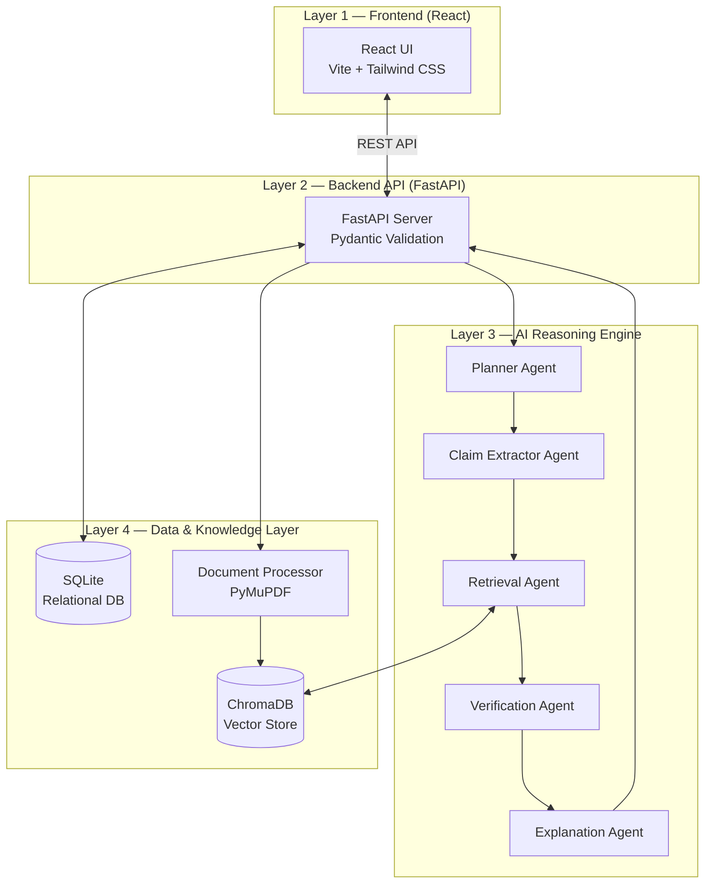
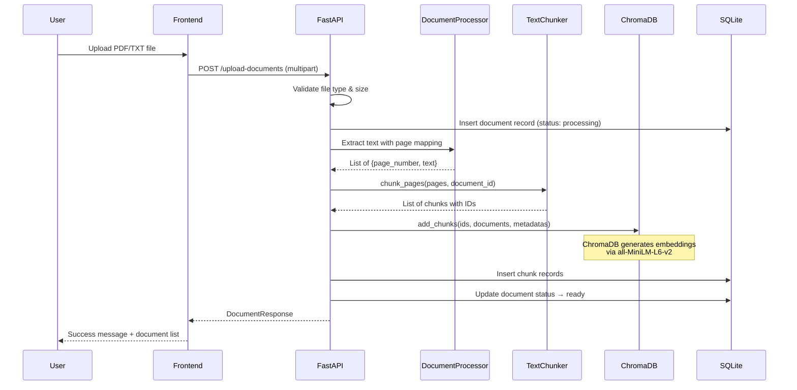
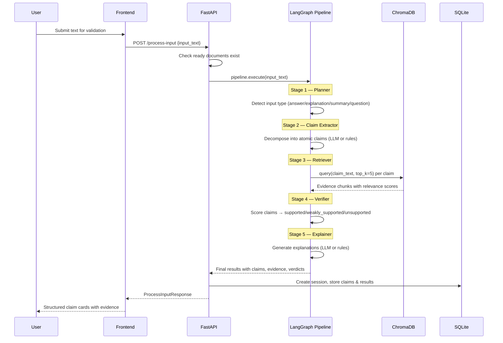
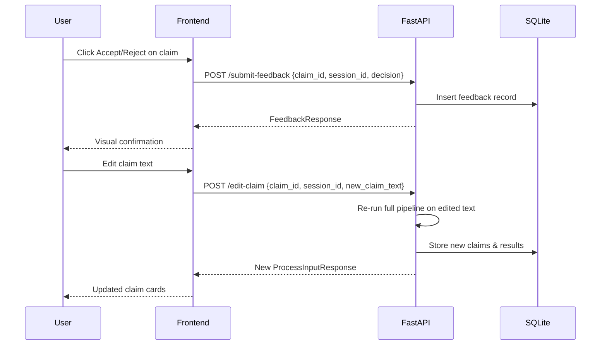

# EviLearn — Claim-Based Knowledge Validation System

> **EviLearn is NOT a chatbot.** It is a structured, evidence-based reasoning system that validates user-submitted knowledge (answers, summaries, explanations) against uploaded reference documents. Every output is traceable to document evidence.

## Core Mechanism

```
Input → Claims → Evidence → Verification → Explanation
```

A user submits text. The system decomposes it into atomic claims, retrieves evidence from uploaded documents, verifies each claim against that evidence, and generates a human-readable explanation for every verdict. No claim is accepted or rejected without document-backed reasoning.

## System Architecture

EviLearn is organized into 4 layers, each with a strict single responsibility:



| Layer | Responsibility | Technology |
|-------|---------------|------------|
| Frontend | Structured reasoning interface | React 19, Vite 8, Tailwind CSS 4 |
| Backend API | Request routing, validation, orchestration | FastAPI, Uvicorn, Pydantic |
| AI Engine | Deterministic multi-agent reasoning pipeline | LangGraph StateGraph |
| Data Layer | Document processing, embedding, storage, retrieval | PyMuPDF, ChromaDB, SQLite |

## Data Flow Diagrams

### Document Upload Flow



### Validation Query Flow



### Feedback Flow



## User Flow

1. **Upload Documents** — User uploads PDF or TXT files that form the knowledge base.
2. **Enter Text** — User submits an answer, summary, or explanation to validate.
3. **View Results** — System displays each extracted claim with a status badge, confidence score, evidence snippets, and explanation.
4. **Provide Feedback** — User can accept, reject, or edit individual claims.
5. **Review History** — User can browse past validation sessions with full results.

## API Endpoint Summary

| Method | Path | Description | Request | Response |
|--------|------|-------------|---------|----------|
| `GET` | `/` | Health check | — | `{status, service, version}` |
| `POST` | `/upload-documents` | Upload & process document | `multipart/form-data` (file) | `DocumentResponse` |
| `GET` | `/documents` | List all documents | — | `{documents: [...]}` |
| `POST` | `/process-input` | Validate text input | `{input_text: string}` | `ProcessInputResponse` |
| `GET` | `/get-results/{session_id}` | Get session results | — | `{session_id, input_text, input_type, claims}` |
| `POST` | `/submit-feedback` | Submit accept/reject | `{claim_id, session_id, decision}` | `FeedbackResponse` |
| `POST` | `/edit-claim` | Edit & re-validate claim | `{claim_id, session_id, new_claim_text}` | `ProcessInputResponse` |
| `GET` | `/history` | Get full history | — | `{sessions: [...]}` |

## Output Contract

Every verified claim returns this structure:

```json
{
  "claim_id": "uuid",
  "claim_text": "The atomic factual claim",
  "status": "supported | weakly_supported | unsupported",
  "confidence_score": 0.0 - 1.0,
  "evidence": [
    {
      "snippet": "Relevant text from document",
      "page_number": 1
    }
  ],
  "explanation": "Human-readable reasoning for the verdict"
}
```

### Status Definitions

| Status | Confidence Range | Meaning |
|--------|-----------------|---------|
| `supported` | ≥ 0.7 | Strong evidence match in documents |
| `weakly_supported` | 0.4 – 0.69 | Partial or indirect evidence found |
| `unsupported` | < 0.4 | No sufficient evidence in documents |

## Tech Stack

| Component | Technology | Version | Purpose |
|-----------|-----------|---------|---------|
| Frontend Framework | React | 19.x | UI components |
| Build Tool | Vite | 8.x | Dev server & bundling |
| CSS | Tailwind CSS | 4.x | Utility-first styling |
| Backend Framework | FastAPI | 0.104+ | REST API server |
| ASGI Server | Uvicorn | 0.24+ | Production server |
| Validation | Pydantic | 2.5+ | Request/response schemas |
| PDF Processing | PyMuPDF (fitz) | 1.23+ | Text extraction |
| Vector Database | ChromaDB | 0.4+ | Embedding storage & retrieval |
| Pipeline | LangGraph | 0.0.20+ | StateGraph orchestration |
| Relational DB | SQLite | Built-in | Session, claims, feedback storage |
| LLM Provider | Groq / OpenAI | — | Claim extraction & explanation |
| LLM Model | Llama 3 8B | — | Default model (configurable) |

## Setup & Installation

### Prerequisites

- Python 3.11+
- Node.js 18+
- npm 9+

### Backend

```bash
cd backend
pip install -r requirements.txt

# Required environment variables
export LLM_API_KEY="your-api-key"        # Groq or OpenAI API key
export LLM_PROVIDER="groq"               # "groq" or "openai"
export LLM_MODEL="llama3-8b-8192"        # LLM model name

# Optional environment variables
export SQLITE_DB_PATH="./evilearn.db"
export CHROMA_PERSIST_DIR="./chroma_db"
export TOP_K_RESULTS="5"
export MAX_FILE_SIZE_MB="50"
export CORS_ORIGINS="http://localhost:5173,http://localhost:3000"

# Run the server
python -m backend.main
```

The backend starts on `http://localhost:8000`.

### Frontend

```bash
cd frontend
npm install
npm run dev
```

The frontend starts on `http://localhost:5173` and proxies `/api` requests to the backend.

### Deployment

| Component | Platform | Notes |
|-----------|----------|-------|
| Frontend | Vercel | Static build via `npm run build` → `dist/` |
| Backend | Render | Python web service, Uvicorn on port 8000 |

## System Guarantees

1. **No claim is verified without document evidence.** The system never uses pre-trained knowledge for verification.
2. **Every verdict is traceable.** Each status links back to specific document snippets and page numbers.
3. **The pipeline order is non-negotiable.** Planner → Claim Extractor → Retriever → Verifier → Explainer.
4. **LLM usage is restricted.** Only the Claim Extractor and Explainer use LLM calls. Verification is purely algorithmic.
5. **Fallback behavior is deterministic.** If the LLM is unavailable, rule-based extraction and explanation are used.
6. **All sessions are audited.** Every input, claim, result, and feedback action is stored in SQLite.

## Limitations

- **PDF only for document upload.** Text files (`.txt`) are also supported, but no other formats (DOCX, HTML, etc.).
- **No real-time document updates.** Documents must be re-uploaded to update the knowledge base.
- **Single-user design.** No authentication or multi-tenancy.
- **Embedding model is fixed at runtime.** Changing the embedding model requires re-processing all documents.
- **No claim deduplication.** Overlapping claims from the same input are not merged.
- **Maximum file size is 50 MB** (configurable via `MAX_FILE_SIZE_MB`).

## Project Structure

```
evilearn/
├── README.md                          # This file
├── backend/
│   ├── README.md                      # Backend documentation
│   ├── app.py                         # FastAPI application
│   ├── config.py                      # Environment configuration
│   ├── schemas.py                     # Pydantic request/response models
│   ├── main.py                        # Uvicorn entry point
│   ├── requirements.txt               # Python dependencies
│   ├── ai_engine/
│   │   ├── README.md                  # AI Engine documentation
│   │   ├── pipeline.py                # LangGraph pipeline orchestration
│   │   └── agents/
│   │       ├── planner.py             # Input type detection
│   │       ├── claim_extractor.py     # Atomic claim extraction
│   │       ├── retriever.py           # Evidence retrieval
│   │       ├── verifier.py            # Claim verification
│   │       └── explainer.py           # Explanation generation
│   └── data_layer/
│       ├── README.md                  # Data Layer documentation
│       ├── document_processor.py      # PDF/text extraction
│       ├── chunker.py                 # Text chunking
│       ├── vector_store.py            # ChromaDB interface
│       └── database.py                # SQLite interface
└── frontend/
    ├── README.md                      # Frontend documentation
    ├── package.json                   # Node.js dependencies
    ├── vite.config.js                 # Vite configuration
    └── src/
        ├── App.jsx                    # Root component
        ├── api.js                     # API client
        └── components/
            ├── DocumentUpload.jsx     # Document upload interface
            ├── ValidationWorkspace.jsx# Text input & submission
            ├── ResultsDisplay.jsx     # Results summary & claim list
            ├── ClaimCard.jsx          # Individual claim display
            ├── EvidenceViewer.jsx     # Evidence snippet display
            └── HistoryDashboard.jsx   # Session history browser
```