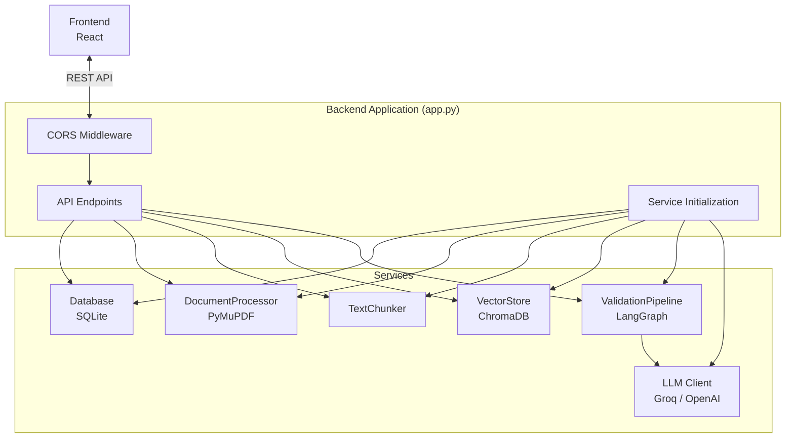
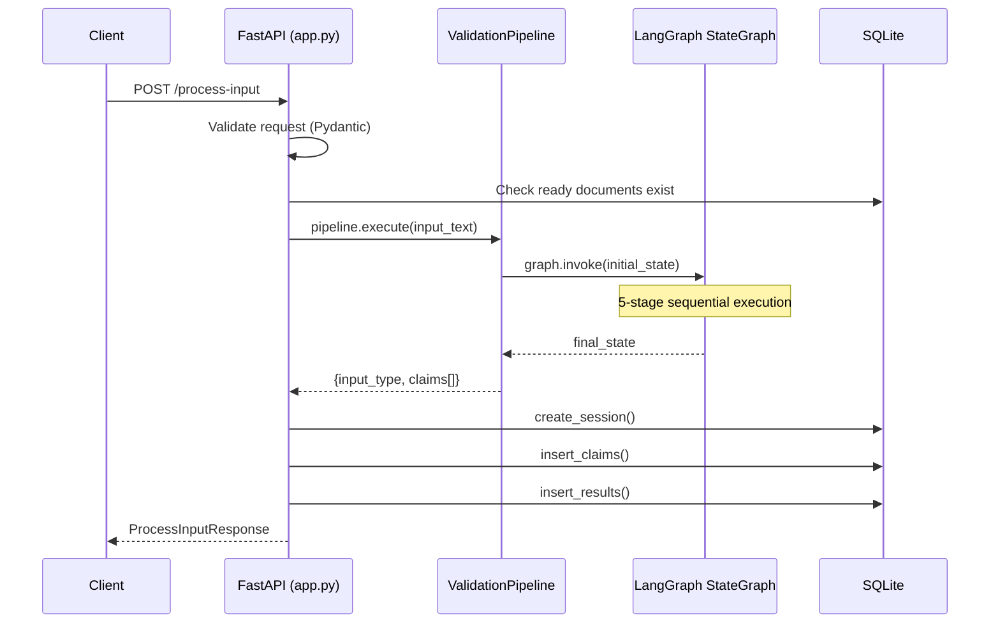

# Backend — API & Orchestration Layer

> The backend is a **control system**, not a reasoning entity. It routes requests, validates input, triggers the AI pipeline, and stores results. All intelligence lives in the AI Engine; all data operations live in the Data Layer.

## Overview

The EviLearn backend is a FastAPI application that serves as the orchestration layer between the React frontend and the AI reasoning engine. It handles document upload processing, validation pipeline execution, session management, feedback collection, and history retrieval.

## Technology

| Component | Technology | Purpose |
|-----------|-----------|---------|
| Web Framework | FastAPI | REST API with automatic OpenAPI docs |
| ASGI Server | Uvicorn | Production-ready async server |
| Validation | Pydantic v2 | Request/response schema enforcement |
| File Upload | `python-multipart` | Multipart form data parsing |
| LLM Client | Groq / OpenAI SDK | Optional LLM for claim extraction & explanation |

## Architecture



## API Endpoints

### Health Check

| Method | Path | Description |
|--------|------|-------------|
| `GET` | `/` | Returns service status |

**Response:**
```json
{"status": "ok", "service": "EviLearn API", "version": "1.0.0"}
```

---

### Document Upload

| Method | Path | Description |
|--------|------|-------------|
| `POST` | `/upload-documents` | Upload and process a PDF or text file |

**Request:** `multipart/form-data` with `file` field

**Response Schema — `DocumentResponse`:**
```json
{
  "document_id": "uuid",
  "file_name": "document.pdf",
  "status": "ready",
  "page_count": 15,
  "message": "Document processed successfully. 42 chunks created."
}
```

**Validation:**
- File extension must be `.pdf` or `.txt`
- File must not be empty
- File size must not exceed `MAX_FILE_SIZE_MB` (default: 50 MB)

**Processing pipeline:**
1. Validate file type and size
2. Generate document ID (UUID)
3. Insert document record in SQLite (status: `processing`)
4. Extract text via `DocumentProcessor`
5. Chunk text via `TextChunker` (500 chars, 50 overlap)
6. Store chunks in ChromaDB (embeddings auto-generated)
7. Store chunks in SQLite
8. Update document status to `ready`

**Error responses:**
| Code | Condition |
|------|-----------|
| 400 | Unsupported file type |
| 400 | Empty file |
| 400 | File exceeds size limit |
| 400 | PDF corrupted or no extractable text |
| 500 | Unexpected processing failure |

---

### List Documents

| Method | Path | Description |
|--------|------|-------------|
| `GET` | `/documents` | List all uploaded documents |

**Response:**
```json
{
  "documents": [
    {
      "document_id": "uuid",
      "file_name": "doc.pdf",
      "upload_time": "2024-01-15T10:30:00",
      "status": "ready",
      "page_count": 10
    }
  ]
}
```

---

### Process Input (Validate)

| Method | Path | Description |
|--------|------|-------------|
| `POST` | `/process-input` | Submit text for validation through the AI pipeline |

**Request Schema — `ProcessInputRequest`:**
```json
{
  "input_text": "Photosynthesis converts CO2 into glucose using sunlight."
}
```

**Response Schema — `ProcessInputResponse`:**
```json
{
  "session_id": "uuid",
  "input_type": "answer",
  "claims": [
    {
      "claim_id": "uuid",
      "claim_text": "Photosynthesis converts CO2 into glucose.",
      "status": "supported",
      "confidence_score": 0.87,
      "evidence": [
        {"snippet": "...", "page_number": 12}
      ],
      "explanation": "This claim is supported by evidence..."
    }
  ],
  "message": ""
}
```

**Error responses:**
| Code | Condition |
|------|-----------|
| 400 | No documents uploaded (knowledge base empty) |
| 400 | Invalid/empty input text |
| 500 | Pipeline stage failure |

---

### Get Results

| Method | Path | Description |
|--------|------|-------------|
| `GET` | `/get-results/{session_id}` | Retrieve results for a specific session |

**Response:**
```json
{
  "session_id": "uuid",
  "input_text": "original text",
  "input_type": "answer",
  "claims": [...]
}
```

**Error responses:**
| Code | Condition |
|------|-----------|
| 404 | Session not found |

---

### Submit Feedback

| Method | Path | Description |
|--------|------|-------------|
| `POST` | `/submit-feedback` | Submit accept/reject feedback for a claim |

**Request Schema — `FeedbackRequest`:**
```json
{
  "claim_id": "uuid",
  "session_id": "uuid",
  "decision": "accept"
}
```

`decision` must match the pattern `^(accept|reject)$`.

**Response Schema — `FeedbackResponse`:**
```json
{
  "feedback_id": "uuid",
  "message": "Feedback 'accept' recorded for claim <claim_id>."
}
```

**Error responses:**
| Code | Condition |
|------|-----------|
| 404 | Session not found |
| 422 | Invalid decision value (not `accept` or `reject`) |

---

### Edit Claim

| Method | Path | Description |
|--------|------|-------------|
| `POST` | `/edit-claim` | Edit a claim and re-run the validation pipeline |

**Request Schema — `EditClaimRequest`:**
```json
{
  "claim_id": "uuid",
  "session_id": "uuid",
  "new_claim_text": "Updated claim text to validate"
}
```

**Response:** Same as `ProcessInputResponse`.

**Behavior:** Re-runs the full validation pipeline on `new_claim_text`, stores new claims and results under the same session.

**Error responses:**
| Code | Condition |
|------|-----------|
| 404 | Session not found |
| 500 | Pipeline execution failure |

---

### History

| Method | Path | Description |
|--------|------|-------------|
| `GET` | `/history` | Retrieve complete validation history |

**Response:**
```json
{
  "sessions": [
    {
      "session_id": "uuid",
      "input_text": "...",
      "input_type": "answer",
      "created_at": "2024-01-15T10:30:00",
      "claims": [...],
      "results": [...],
      "feedback": [...]
    }
  ]
}
```

## Pipeline Orchestration



## Request Validation (Pydantic Schemas)

All request bodies are validated by Pydantic v2 models defined in `schemas.py`:

| Schema | Fields | Validation |
|--------|--------|------------|
| `ProcessInputRequest` | `input_text` | `min_length=1` |
| `FeedbackRequest` | `claim_id`, `session_id`, `decision` | `decision` matches `^(accept\|reject)$` |
| `EditClaimRequest` | `claim_id`, `session_id`, `new_claim_text` | `new_claim_text` has `min_length=1` |

Invalid requests receive a `422 Unprocessable Entity` response with Pydantic validation errors.

## Session & State Handling

- **Sessions are created per validation request.** Each `POST /process-input` creates a new session.
- **Session ID is a UUID** generated by the Database module.
- **No authentication.** Sessions are not user-scoped.
- **Session data is immutable** once created (except for feedback additions and claim edits).
- **Edited claims** are appended to the existing session, not replaced.

## Audit Logging

Every user action is persisted in SQLite:

| Action | Stored Data |
|--------|-------------|
| Document upload | `document_id`, `file_name`, `upload_time`, `status`, `page_count` |
| Validation request | `session_id`, `input_text`, `input_type`, `created_at` |
| Claim extraction | `claim_id`, `session_id`, `claim_text` |
| Verification result | `result_id`, `claim_id`, `session_id`, `status`, `confidence_score`, `evidence` (JSON), `explanation` |
| User feedback | `feedback_id`, `claim_id`, `session_id`, `user_decision`, `created_at` |

## Feedback Handling

| Decision | Description | Storage |
|----------|-------------|---------|
| `accept` | User agrees with the verification result | Stored in `feedback` table |
| `reject` | User disagrees with the verification result | Stored in `feedback` table |
| `edit` | User modifies claim text and re-validates | New claims/results appended to session |

Feedback does **not** modify existing results. It is recorded for audit purposes only. The system does not learn from feedback.

## Error Handling

| Scenario | HTTP Code | Detail |
|----------|-----------|--------|
| No documents uploaded | 400 | "No knowledge base available. Please upload documents first." |
| Unsupported file type | 400 | Lists allowed extensions |
| Empty file | 400 | "Uploaded file is empty." |
| File too large | 400 | States maximum size |
| Corrupted PDF | 400 | DocumentProcessor error message |
| Empty input text | 400 | Planner or Pydantic validation error |
| Invalid feedback decision | 422 | Pydantic pattern validation |
| Session not found | 404 | "Session not found." |
| Pipeline stage failure | 500 | Stage-specific error message |
| Document processing failure | 500 | "Document processing failed: ..." |

All errors use FastAPI's `HTTPException` with structured JSON responses.

## CORS Configuration

Configured via the `CORS_ORIGINS` environment variable (comma-separated list):

```python
app.add_middleware(
    CORSMiddleware,
    allow_origins=settings.CORS_ORIGINS,  # Default: localhost:5173, localhost:3000
    allow_credentials=True,
    allow_methods=["*"],
    allow_headers=["*"],
)
```

Default origins: `http://localhost:5173` (Vite dev server), `http://localhost:3000`.

## Configuration (Environment Variables)

| Variable | Default | Description |
|----------|---------|-------------|
| `SQLITE_DB_PATH` | `./evilearn.db` | SQLite database file path |
| `CHROMA_PERSIST_DIR` | `./chroma_db` | ChromaDB persistence directory |
| `LLM_API_KEY` | `""` | API key for Groq or OpenAI |
| `LLM_MODEL` | `llama3-8b-8192` | LLM model name |
| `LLM_PROVIDER` | `groq` | `groq` or `openai` |
| `EMBEDDING_MODEL` | `all-MiniLM-L6-v2` | SentenceTransformer model |
| `TOP_K_RESULTS` | `5` | Number of evidence chunks to retrieve |
| `MAX_FILE_SIZE_MB` | `50` | Maximum upload file size in MB |
| `CORS_ORIGINS` | `http://localhost:5173,...` | Allowed CORS origins |

## Response Format

All responses are **structured JSON**, never conversational text. The API returns:
- Typed Pydantic models for success responses
- `HTTPException` with `detail` field for errors
- No streaming, no server-sent events

## Running the Server

```bash
cd backend
pip install -r requirements.txt
python -m backend.main
```

The server starts on `http://0.0.0.0:8000` with auto-reload enabled.

## Limitations

- **No authentication or authorization.** All endpoints are publicly accessible.
- **No rate limiting.** No protection against excessive requests.
- **Synchronous pipeline execution.** Long validation requests block the event loop.
- **No file deletion endpoint.** Documents can only be added, not removed via the API.
- **No pagination** on list endpoints (`/documents`, `/history`).
- **No WebSocket support.** No real-time progress updates during pipeline execution.
- **Single-process deployment.** No worker pool or horizontal scaling.
