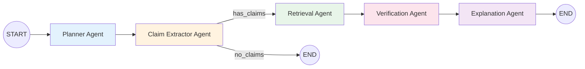
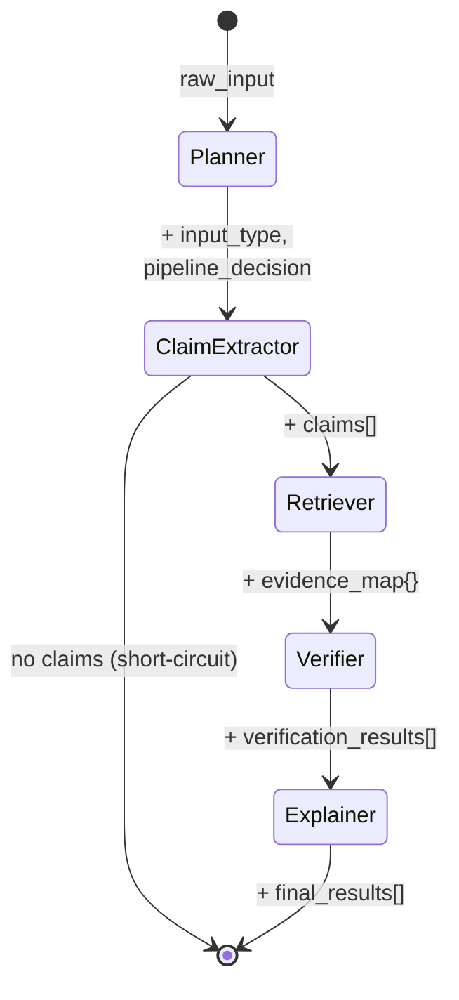
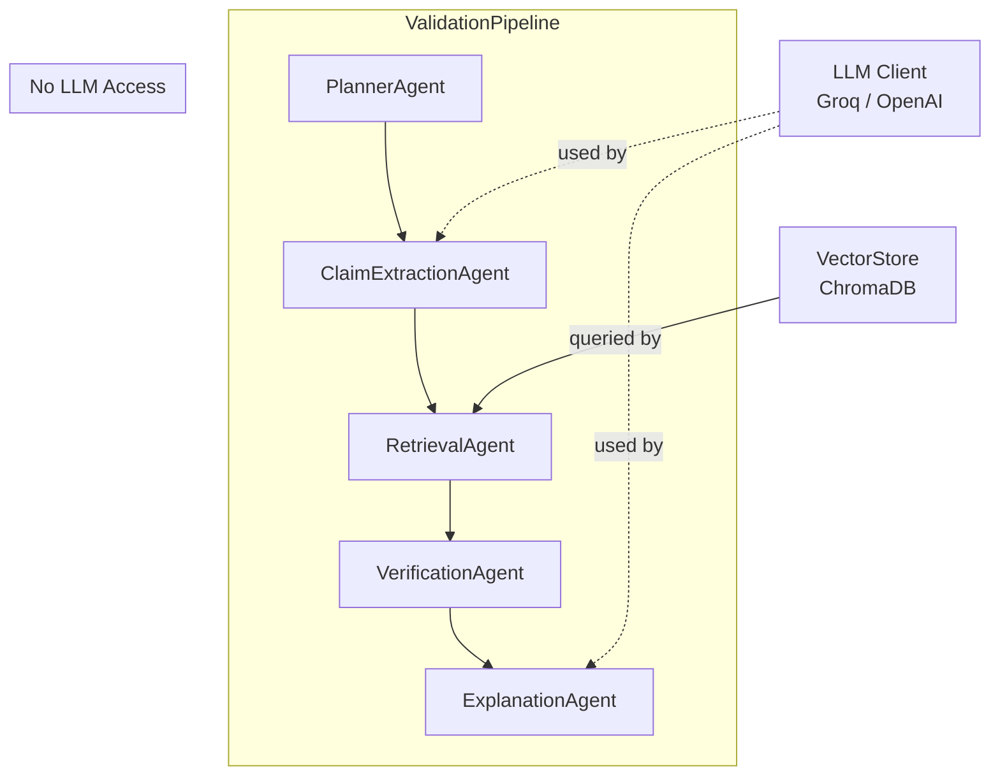

# AI Reasoning Engine

> This module implements a **deterministic multi-agent reasoning pipeline** using LangGraph StateGraph. Every agent has a fixed role, fixed inputs, and fixed outputs. The pipeline order is non-negotiable.

## Overview

The AI Engine decomposes user text into atomic claims, retrieves document evidence for each claim, verifies claims against that evidence, and generates human-readable explanations. It is **not** a conversational AI — it is a structured reasoning system where each stage produces traceable, auditable outputs.

## Architecture — LangGraph StateGraph Pipeline



The pipeline is a strict 5-stage sequence implemented as a LangGraph `StateGraph`. Each agent is a node. Edges are strictly sequential except for the conditional edge after Claim Extraction (which short-circuits to END if no claims are extracted).

## Pipeline State

The `PipelineState` TypedDict flows through all nodes:

```python
class PipelineState(TypedDict):
    raw_input: str                      # Original user text
    input_type: str                     # answer | explanation | summary | question
    pipeline_decision: str              # Always "validation"
    claims: list[dict]                  # Extracted atomic claims
    evidence_map: dict                  # claim_id → list of evidence objects
    verification_results: list[dict]    # Claims with status + confidence
    final_results: list[dict]           # Claims with explanations added
    error: Optional[str]                # Error message if any stage fails
```

## Pipeline State Flow



## Agents

### 1. Planner Agent (`agents/planner.py`)

**Role:** Classify the type of user input and decide pipeline routing.

| Property | Value |
|----------|-------|
| **Input** | `raw_input` (string) |
| **Output** | `{input_type, pipeline_decision, original_input}` |
| **Uses LLM** | No |
| **Deterministic** | Yes |

**Input Type Detection Rules:**

| Check | Detection Method | Result |
|-------|-----------------|--------|
| Ends with `?` | String check | `question` |
| Starts with question word | Prefix match (`what`, `how`, `why`, `when`, `where`, `who`, `which`, `is`, `are`, `do`, `does`, `can`, `could`) | `question` |
| Contains explanation keyword | Substring search (`because`, `therefore`, `this means`, `the reason`, `this is due to`, `as a result`, `consequently`) | `explanation` |
| Contains summary keyword | Substring search (`in summary`, `to summarize`, `overall`, `in conclusion`, `the main points`) | `summary` |
| Default | — | `answer` |

**Rules:**
- Pipeline decision is always `"validation"` — there is no alternative routing.
- Empty input raises `ValueError`.
- Detection is case-insensitive.
- Priority order: question → explanation → summary → answer (default).

---

### 2. Claim Extraction Agent (`agents/claim_extractor.py`)

**Role:** Decompose input text into atomic, independently verifiable factual claims.

| Property | Value |
|----------|-------|
| **Input** | `text` (string), `input_type` (string) |
| **Output** | `list[{claim_id: UUID, claim_text: string}]` |
| **Uses LLM** | Yes (with fallback) |
| **Deterministic** | Fallback only |

**LLM extraction:**
- Model: Configurable via `LLM_MODEL` env var (default: `llama3-8b-8192`)
- Temperature: `0.1` (near-deterministic)
- Max tokens: `1024`
- Prompt instructs the LLM to return a JSON array of claim strings
- Response is parsed by searching for `[...]` JSON array pattern via regex

**Rule-based fallback** (used when LLM is unavailable or fails):
1. Split text by sentence-ending punctuation (`.` or `!`) followed by whitespace.
2. Filter out sentences shorter than 10 characters.
3. Filter out questions (sentences ending with `?`).
4. Each remaining sentence becomes one claim.

**Rules:**
- Each claim gets a unique UUID (`claim_id`).
- Empty/whitespace-only input returns `[]`.
- If LLM fails, fallback is used silently (no error propagated).

---

### 3. Retrieval Agent (`agents/retriever.py`)

**Role:** Retrieve relevant document evidence for each extracted claim.

| Property | Value |
|----------|-------|
| **Input** | `claims` (list of claim dicts), `top_k` (int, default 5) |
| **Output** | `dict` mapping `claim_id` → `list[evidence_object]` |
| **Uses LLM** | No |
| **Deterministic** | Yes (given fixed embeddings) |

**Evidence object structure:**
```json
{
  "text_snippet": "Retrieved chunk text",
  "page_number": 1,
  "relevance_score": 0.8542,
  "document_id": "uuid"
}
```

**Rules:**
- Queries ChromaDB once per claim using the claim text as the search query.
- ChromaDB handles embedding the query text internally (same model as indexing).
- If a query fails for any claim, that claim gets an empty evidence list `[]` (no error raised).
- Default `top_k=5` chunks per claim.

---

### 4. Verification Agent (`agents/verifier.py`)

**Role:** Evaluate each claim against its retrieved evidence and assign a status and confidence score.

| Property | Value |
|----------|-------|
| **Input** | `claims` (list), `evidence_map` (dict) |
| **Output** | `list[{claim_id, claim_text, status, confidence_score, evidence}]` |
| **Uses LLM** | No |
| **Deterministic** | Yes |

**Scoring algorithm:**

```
combined_score = (max_relevance × 0.5) + (avg_relevance × 0.2) + (best_keyword_overlap × 0.3)
```

Where:
- `max_relevance` = highest `relevance_score` among all evidence for the claim
- `avg_relevance` = mean `relevance_score` across all evidence
- `best_keyword_overlap` = maximum word overlap ratio between claim words and any evidence snippet

**Status thresholds:**

| Combined Score | Status | Confidence Score |
|---------------|--------|-----------------|
| ≥ 0.7 | `supported` | `min(combined_score, 1.0)` |
| 0.4 – 0.69 | `weakly_supported` | `combined_score` |
| < 0.4 | `unsupported` | `max(combined_score, 0.05)` |
| No evidence | `unsupported` | `0.1` |

**Rules:**
- Only the top 3 evidence pieces are attached to each result.
- Verification is purely algorithmic — no LLM, no external knowledge.
- Evidence is reformatted to `{snippet, page_number}` for the output.

---

### 5. Explanation Agent (`agents/explainer.py`)

**Role:** Generate human-readable explanations for each verification result.

| Property | Value |
|----------|-------|
| **Input** | `verification_results` (list of verified claim dicts) |
| **Output** | Same list with `explanation` field added to each entry |
| **Uses LLM** | Yes (with fallback) |
| **Deterministic** | Fallback only |

**LLM explanation:**
- Model: Configurable via `LLM_MODEL` env var (default: `llama3-8b-8192`)
- Temperature: `0.2`
- Max tokens: `256`
- Prompt includes claim text, status, confidence, and evidence snippets
- Instructed to write 2–3 sentences referencing evidence
- **Does NOT change the verification decision**

**Rule-based fallback** (used when LLM is unavailable or fails):

| Status | Template |
|--------|----------|
| `supported` (with evidence) | References page numbers, states evidence closely matches the assertion |
| `supported` (no evidence) | States claim is marked as supported with confidence |
| `weakly_supported` (with evidence) | References page numbers, states partial/indirect support |
| `weakly_supported` (no evidence) | States weak support with confidence |
| `unsupported` (with evidence) | States evidence does not sufficiently support the claim |
| `unsupported` (no evidence) | States no supporting evidence was found |

**Rules:**
- Explanations are appended to existing verification results (mutation).
- If LLM fails for one claim, fallback is used for that claim only.
- Explanations never override the status or confidence score.

## Component Interaction



## Data Contracts

### Claim Object (output of Claim Extractor)
```json
{
  "claim_id": "550e8400-e29b-41d4-a716-446655440000",
  "claim_text": "Photosynthesis converts carbon dioxide into glucose."
}
```

### Evidence Object (output of Retriever, per claim)
```json
{
  "text_snippet": "During photosynthesis, plants convert CO2 and water into glucose...",
  "page_number": 12,
  "relevance_score": 0.8734,
  "document_id": "660e8400-e29b-41d4-a716-446655440001"
}
```

### Verification Output (output of Verifier)
```json
{
  "claim_id": "550e8400-e29b-41d4-a716-446655440000",
  "claim_text": "Photosynthesis converts carbon dioxide into glucose.",
  "status": "supported",
  "confidence_score": 0.87,
  "evidence": [
    {"snippet": "...", "page_number": 12},
    {"snippet": "...", "page_number": 13}
  ]
}
```

### Explanation Output (output of Explainer)
```json
{
  "claim_id": "550e8400-e29b-41d4-a716-446655440000",
  "claim_text": "Photosynthesis converts carbon dioxide into glucose.",
  "status": "supported",
  "confidence_score": 0.87,
  "evidence": [{"snippet": "...", "page_number": 12}],
  "explanation": "This claim is supported by evidence found in the uploaded documents (page 12, page 13). The retrieved content closely matches the assertion with a confidence score of 0.87."
}
```

## Cross-Agent Constraints

1. **Planner cannot modify input.** It only classifies and routes.
2. **Claim Extractor cannot verify.** It only decomposes text into claims.
3. **Retriever cannot reason about evidence.** It only fetches from ChromaDB.
4. **Verifier cannot use LLM.** Scoring is purely algorithmic (relevance + keyword overlap).
5. **Explainer cannot change verification.** It only generates natural language for existing decisions.
6. **No backward flow.** No agent can send data back to a previous agent.
7. **LLM usage is restricted** to Claim Extractor and Explainer only.

## Edge Case Handling

| Edge Case | Behavior |
|-----------|----------|
| Empty input | Planner raises `ValueError` → pipeline aborts |
| No claims extracted | Conditional edge routes to END → response includes message "No factual claims could be extracted" |
| No evidence for a claim | Retriever returns `[]` → Verifier sets status `unsupported`, confidence `0.1` |
| LLM unavailable | Claim Extractor uses rule-based sentence splitting; Explainer uses template-based explanations |
| LLM returns unparseable response | Claim Extractor falls back to rule-based extraction (exception caught silently) |
| Ambiguous claims | Treated as normal claims — no special handling. Verification score will reflect evidence quality. |
| Conflicting evidence | Combined score algorithm naturally produces a lower score, typically resulting in `weakly_supported` |
| Very short sentences (< 10 chars) | Filtered out by rule-based claim extractor |
| Questions in input | Detected by Planner as `question` type; still processed through pipeline |
| Pipeline stage failure | Raises `ValueError` or `RuntimeError` with descriptive message |

## LLM Usage Policy

| Agent | Uses LLM | Purpose | Fallback |
|-------|----------|---------|----------|
| Planner | **No** | — | — |
| Claim Extractor | **Yes** | Intelligent claim decomposition | Sentence splitting |
| Retriever | **No** | — | — |
| Verifier | **No** | — | — |
| Explainer | **Yes** | Natural language explanation | Template-based explanation |

**Rationale:** Verification must be deterministic and reproducible. LLMs are only used where human-like language understanding (extraction) or generation (explanation) is required. The verification decision itself is always algorithmic.

## Limitations

- **No claim deduplication.** Overlapping or equivalent claims are processed independently.
- **Keyword overlap is case-insensitive but not lemmatized.** "running" and "run" are treated as different words.
- **Verification is text-matching only.** No logical inference, negation detection, or semantic entailment.
- **Confidence scores are heuristic.** They combine relevance and keyword overlap, not true probability.
- **Rule-based fallback is coarse.** Sentence splitting may produce non-factual claims (e.g., opinions, rhetorical statements).
- **No agent memory.** Each pipeline execution is independent — no learning from feedback.
- **LLM temperature is fixed.** Not configurable per-request.
