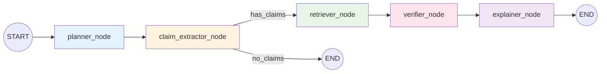
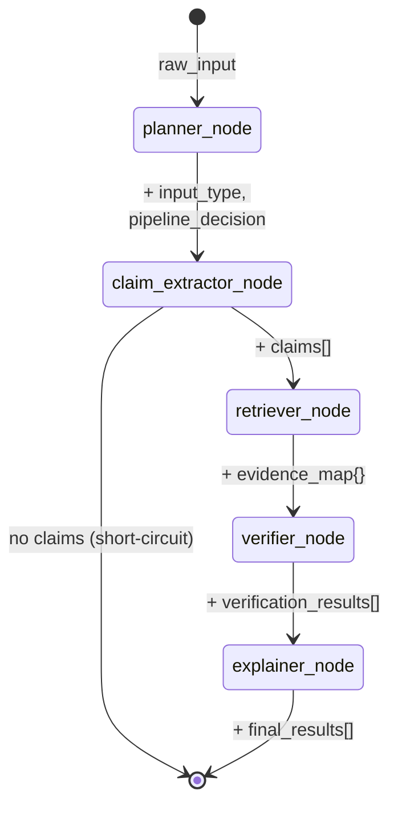
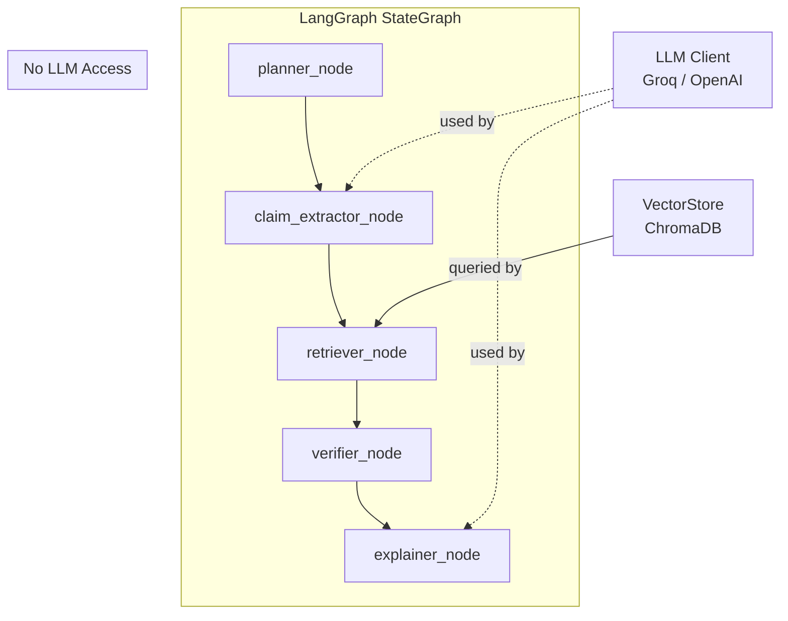

# AI Reasoning Engine

> This module implements a **graph-native multi-agent reasoning system** using LangGraph StateGraph. All agent logic exists as **pure functions** (graph nodes) operating on shared state. There are NO agent classes. The pipeline order is non-negotiable.

## Overview

The AI Engine decomposes user text into atomic claims, retrieves document evidence for each claim, verifies claims against that evidence, and generates human-readable explanations. It is **not** a conversational AI — it is a structured reasoning system where each stage produces traceable, auditable outputs.

**Architecture principle:** Every agent is a LangGraph node — a pure function that reads from shared state and writes only its assigned fields. There are no standalone agent classes, no OOP wrappers, and no hidden sequencing.

## Architecture — LangGraph StateGraph Pipeline



The pipeline is a strict 5-stage sequence implemented as a LangGraph `StateGraph`. Each agent is a **pure function** registered as a node via `graph.add_node()`. Edges are strictly sequential except for the conditional edge after claim extraction (which short-circuits to END if no claims are extracted).

## File Structure

```
backend/ai_engine/
├── __init__.py      # Exports: ValidationPipeline, build_validation_graph
├── pipeline.py      # ALL agent logic — pure functions + StateGraph + graph builder
└── README.md        # This file
```

There is **no `agents/` directory**. All agent logic is defined inline in `pipeline.py` as top-level pure functions.

## Pipeline State

The `PipelineState` TypedDict is the shared state flowing through all nodes:

```python
class PipelineState(TypedDict):
    # Injected dependencies (set once, never mutated by nodes)
    _vector_store: object       # ChromaDB VectorStore
    _llm_client: object         # Groq / OpenAI client (or None)

    # Pipeline data (each field written by exactly one node)
    raw_input: str              # Original user text
    input_type: str             # Written by planner_node
    pipeline_decision: str      # Written by planner_node
    claims: list[dict]          # Written by claim_extractor_node
    evidence_map: dict          # Written by retriever_node
    verification_results: list[dict]  # Written by verifier_node
    final_results: list[dict]   # Written by explainer_node
    error: Optional[str]        # Error field
```

### State Discipline

Each node:
- **Reads** only the fields it needs
- **Writes** only its assigned fields
- **Never** overwrites unrelated data

## Pipeline State Flow



## Node Definitions

### Node 1: `planner_node(state)` — Input Classification

**Role:** Classify the type of user input and decide pipeline routing.

| Property | Value |
|----------|-------|
| **Reads** | `raw_input` |
| **Writes** | `input_type`, `pipeline_decision` |
| **Uses LLM** | No |
| **Deterministic** | Yes |

**Input Type Detection Rules:**

| Check | Detection Method | Result |
|-------|-----------------|--------|
| Ends with `?` | String check | `question` |
| Starts with question word | Prefix match (`what`, `how`, `why`, `when`, `where`, `who`, `which`, `is`, `are`, `do`, `does`, `can`, `could`) | `question` |
| Contains explanation keyword | Substring search (`because`, `therefore`, `this means`, `the reason`, `this is due to`, `as a result`, `consequently`) | `explanation` |
| Contains summary keyword | Substring search (`in summary`, `to summarize`, `overall`, `in conclusion`, `the main points`) | `summary` |
| Default | — | `answer` |

**Rules:**
- Pipeline decision is always `"validation"`.
- Empty input raises `ValueError`.
- Detection is case-insensitive.
- Priority order: question → explanation → summary → answer (default).

---

### Node 2: `claim_extractor_node(state)` — Atomic Claim Decomposition

**Role:** Decompose input text into atomic, independently verifiable factual claims.

| Property | Value |
|----------|-------|
| **Reads** | `raw_input`, `input_type`, `_llm_client` |
| **Writes** | `claims` |
| **Uses LLM** | Yes (with fallback) |
| **Deterministic** | Fallback only |

**LLM extraction:**
- Model: Configurable via `LLM_MODEL` env var (default: `llama3-8b-8192`)
- Temperature: `0.1` (near-deterministic)
- Max tokens: `1024`
- Prompt instructs the LLM to return a JSON array of claim strings
- Response is parsed by searching for `[...]` JSON array pattern via regex

**Rule-based fallback** (used when LLM is unavailable or fails):
1. Split text by sentence-ending punctuation (`.` or `!`) followed by whitespace.
2. Filter out sentences shorter than 10 characters.
3. Filter out questions (sentences ending with `?`).
4. Each remaining sentence becomes one claim.

**Rules:**
- Each claim gets a unique UUID (`claim_id`).
- Empty/whitespace-only input returns `[]`.
- If LLM fails, fallback is used silently (no error propagated).

---

### Node 3: `retriever_node(state)` — Document Evidence Retrieval

**Role:** Retrieve relevant document evidence for each extracted claim.

| Property | Value |
|----------|-------|
| **Reads** | `claims`, `_vector_store` |
| **Writes** | `evidence_map` |
| **Uses LLM** | No |
| **Deterministic** | Yes (given fixed embeddings) |

**Evidence object structure:**
```json
{
  "text_snippet": "Retrieved chunk text",
  "page_number": 1,
  "relevance_score": 0.8542,
  "document_id": "uuid"
}
```

**Rules:**
- Queries ChromaDB once per claim using the claim text as the search query.
- ChromaDB handles embedding the query text internally.
- If a query fails for any claim, that claim gets an empty evidence list `[]`.
- Default `top_k=5` chunks per claim.

---

### Node 4: `verifier_node(state)` — Evidence-Based Verification

**Role:** Evaluate each claim against its retrieved evidence and assign a status and confidence score.

| Property | Value |
|----------|-------|
| **Reads** | `claims`, `evidence_map` |
| **Writes** | `verification_results` |
| **Uses LLM** | No |
| **Deterministic** | Yes |

**Verification uses only the highest `relevance_score` from ChromaDB.**

**Status thresholds:**

| Max Relevance Score | Status | Confidence Score |
|---------------------|--------|-----------------|
| ≥ 0.7 | `supported` | `min(max_relevance, 1.0)` |
| 0.4 – 0.69 | `weakly_supported` | `max_relevance` |
| < 0.4 | `unsupported` | `max(max_relevance, 0.05)` |
| No evidence | `unsupported` | `0.1` |

**Rules:**
- Only the top 3 evidence pieces are attached to each result.
- Verification is purely evidence-based — no LLM, no external knowledge, no composite scoring.
- Evidence is reformatted to `{snippet, page_number}` for the output.

---

### Node 5: `explainer_node(state)` — Explanation Generation

**Role:** Generate human-readable explanations for each verification result.

| Property | Value |
|----------|-------|
| **Reads** | `verification_results`, `_llm_client` |
| **Writes** | `final_results` |
| **Uses LLM** | Yes (with fallback) |
| **Deterministic** | Fallback only |

**LLM explanation:**
- Model: Configurable via `LLM_MODEL` env var (default: `llama3-8b-8192`)
- Temperature: `0.2`
- Max tokens: `256`
- Prompt includes claim text, status, confidence, and evidence snippets
- **Does NOT change the verification decision**

**Rule-based fallback** (used when LLM is unavailable or fails):

| Status | Template |
|--------|----------|
| `supported` (with evidence) | References page numbers, states evidence closely matches the assertion |
| `supported` (no evidence) | States claim is marked as supported with confidence |
| `weakly_supported` (with evidence) | References page numbers, states partial/indirect support |
| `weakly_supported` (no evidence) | States weak support with confidence |
| `unsupported` (with evidence) | States evidence does not sufficiently support the claim |
| `unsupported` (no evidence) | States no supporting evidence was found |

**Rules:**
- A new dict is created for each result (no mutation of verification_results).
- If LLM fails for one claim, rule-based fallback is used for that claim only.
- Explanations never override the status or confidence score.

## Component Interaction



## Graph Construction

The graph is built by `build_validation_graph()`:

```python
def build_validation_graph():
    graph = StateGraph(PipelineState)

    # Register pure-function nodes
    graph.add_node("planner", planner_node)
    graph.add_node("claim_extractor", claim_extractor_node)
    graph.add_node("retriever", retriever_node)
    graph.add_node("verifier", verifier_node)
    graph.add_node("explainer", explainer_node)

    # Strict sequential edges
    graph.add_edge(START, "planner")
    graph.add_edge("planner", "claim_extractor")
    graph.add_conditional_edges(
        "claim_extractor", check_claims_extracted,
        {"has_claims": "retriever", "no_claims": END},
    )
    graph.add_edge("retriever", "verifier")
    graph.add_edge("verifier", "explainer")
    graph.add_edge("explainer", END)

    return graph.compile()
```

## Data Contracts

### Claim Object (output of claim_extractor_node)
```json
{
  "claim_id": "550e8400-e29b-41d4-a716-446655440000",
  "claim_text": "Photosynthesis converts carbon dioxide into glucose."
}
```

### Evidence Object (output of retriever_node, per claim)
```json
{
  "text_snippet": "During photosynthesis, plants convert CO2 and water into glucose...",
  "page_number": 12,
  "relevance_score": 0.8734,
  "document_id": "660e8400-e29b-41d4-a716-446655440001"
}
```

### Verification Output (output of verifier_node)
```json
{
  "claim_id": "550e8400-e29b-41d4-a716-446655440000",
  "claim_text": "Photosynthesis converts carbon dioxide into glucose.",
  "status": "supported",
  "confidence_score": 0.87,
  "evidence": [
    {"snippet": "...", "page_number": 12},
    {"snippet": "...", "page_number": 13}
  ]
}
```

### Final Output (output of explainer_node)
```json
{
  "claim_id": "550e8400-e29b-41d4-a716-446655440000",
  "claim_text": "Photosynthesis converts carbon dioxide into glucose.",
  "status": "supported",
  "confidence_score": 0.87,
  "evidence": [{"snippet": "...", "page_number": 12}],
  "explanation": "This claim is supported by evidence found in the uploaded documents (page 12, page 13)."
}
```

## Cross-Node Constraints

1. **planner_node cannot modify input.** It only classifies and routes.
2. **claim_extractor_node cannot verify.** It only decomposes text into claims.
3. **retriever_node cannot reason about evidence.** It only fetches from ChromaDB.
4. **verifier_node cannot use LLM.** Status is assigned purely from evidence relevance scores.
5. **explainer_node cannot change verification.** It only generates text for existing decisions.
6. **No backward flow.** No node can send data back to a previous node.
7. **LLM usage is restricted** to claim_extractor_node and explainer_node only.

## Edge Case Handling

| Edge Case | Behavior |
|-----------|----------|
| Empty input | planner_node raises `ValueError` → pipeline aborts |
| No claims extracted | Conditional edge routes to END → response includes message "No factual claims could be extracted" |
| No evidence for a claim | retriever_node returns `[]` → verifier_node sets status `unsupported`, confidence `0.1` |
| LLM unavailable | claim_extractor_node uses rule-based splitting; explainer_node uses template-based explanations |
| LLM returns unparseable response | claim_extractor_node falls back to rule-based extraction |
| Ambiguous claims | Verification score reflects evidence quality |
| Conflicting evidence | Lower relevance score → `weakly_supported` or `unsupported` |
| Very short sentences (< 10 chars) | Filtered out by rule-based claim extractor |
| Questions in input | Detected by planner_node as `question` type; still processed |
| Pipeline stage failure | Raises `ValueError` or `RuntimeError` |

## LLM Usage Policy

| Node | Uses LLM | Purpose | Fallback |
|------|----------|---------|----------|
| planner_node | **No** | — | — |
| claim_extractor_node | **Yes** | Intelligent claim decomposition | Sentence splitting |
| retriever_node | **No** | — | — |
| verifier_node | **No** | — | — |
| explainer_node | **Yes** | Natural language explanation | Template-based explanation |

**Rationale:** Verification must be deterministic and reproducible. LLMs are only used where human-like language understanding (extraction) or generation (explanation) is required. The verification decision itself is always evidence-based.

## Limitations

- **No claim deduplication.** Overlapping or equivalent claims are processed independently.
- **Verification is evidence-relevance only.** No logical inference, negation detection, or semantic entailment.
- **Confidence scores are heuristic.** They reflect ChromaDB cosine similarity, not true probability.
- **Rule-based fallback is coarse.** Sentence splitting may produce non-factual claims.
- **No agent memory.** Each pipeline execution is independent.
- **LLM temperature is fixed.** Not configurable per-request.
