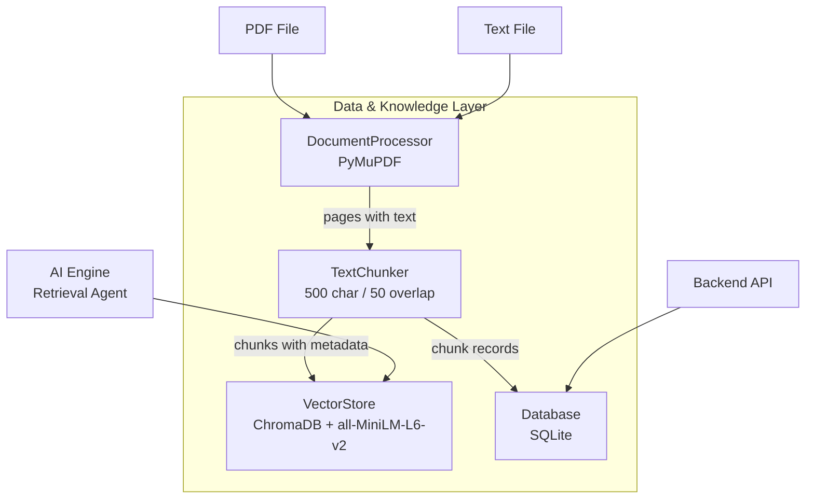
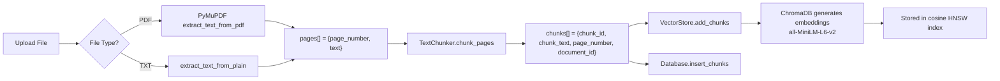
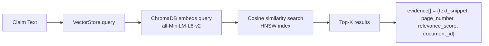

# Data & Knowledge Layer

> This layer is a **pure data system** — it stores, chunks, embeds, and retrieves document content. It performs **no reasoning, verification, or interpretation**. All intelligence lives in the AI Engine.

## Overview

The Data Layer handles the full lifecycle of document data: ingestion (PDF/text extraction), chunking (splitting into retrievable units), embedding & storage (ChromaDB with SentenceTransformers), relational storage (SQLite for sessions, claims, results, feedback), and similarity retrieval (cosine search over embedded chunks).

## Technology

| Component | Technology | Purpose |
|-----------|-----------|---------|
| PDF Extraction | PyMuPDF (`fitz`) | Extract text with page mapping from PDF files |
| Text Chunking | Custom `TextChunker` | Split text into overlapping chunks at sentence boundaries |
| Vector Store | ChromaDB | Persistent vector storage with cosine similarity search |
| Embeddings | SentenceTransformers (`all-MiniLM-L6-v2`) | Automatic embedding via ChromaDB's built-in function |
| Relational DB | SQLite | Sessions, claims, results, feedback, document metadata |

## Architecture



## Component Breakdown

### DocumentProcessor (`document_processor.py`)

Extracts raw text from uploaded files while preserving page numbers.

| Method | Input | Output | Notes |
|--------|-------|--------|-------|
| `extract_text_from_pdf(file_bytes)` | Raw PDF bytes | `list[{page_number, text}]` | Uses PyMuPDF; skips pages with no text |
| `extract_text_from_plain(content)` | Raw text string | `[{page_number: 1, text}]` | Treats entire input as page 1 |
| `generate_document_id()` | — | UUID string | Static method |

**Error handling:**
- Corrupted PDF → raises `ValueError("Failed to open PDF: ...")`
- PDF with no extractable text → raises `ValueError("PDF contains no extractable text.")`
- Empty text input → raises `ValueError("Text content is empty.")`

---

### TextChunker (`chunker.py`)

Splits page text into fixed-size chunks with overlap, preserving page mapping.

| Parameter | Default | Description |
|-----------|---------|-------------|
| `chunk_size` | 500 | Maximum characters per chunk |
| `chunk_overlap` | 50 | Character overlap between consecutive chunks |

| Method | Input | Output |
|--------|-------|--------|
| `chunk_pages(pages, document_id)` | List of `{page_number, text}`, document ID | List of `{chunk_id, chunk_text, page_number, document_id}` |

**Chunking algorithm:**
1. If page text ≤ `chunk_size`, the entire page becomes one chunk.
2. Otherwise, iterate with a sliding window of `chunk_size` characters.
3. At each step, try to break at the nearest sentence boundary (`.`) or newline (`\n`) before the window end.
4. Advance by `chunk_size - chunk_overlap` characters for the next window.
5. Each chunk gets a unique UUID.

---

### VectorStore (`vector_store.py`)

Manages vector storage and cosine similarity retrieval using ChromaDB. Embeddings are generated automatically by ChromaDB's built-in `SentenceTransformerEmbeddingFunction`.

| Method | Input | Output | Notes |
|--------|-------|--------|-------|
| `add_chunks(chunk_ids, documents, metadatas)` | Lists of IDs, text, metadata | None | ChromaDB generates embeddings automatically |
| `query(query_text, top_k, document_id?)` | Query string, result count, optional filter | `list[{text_snippet, page_number, relevance_score, document_id}]` | Cosine distance → relevance score |
| `delete_document(document_id)` | Document ID | None | Deletes all chunks for a document |

**ChromaDB collection configuration:**
- Collection name: `evilearn_documents`
- Distance metric: `cosine` (via `hnsw:space`)
- Embedding model: `all-MiniLM-L6-v2`
- Persistence: Local directory (`./chroma_db` default)

**Relevance score calculation:**
```
relevance_score = max(0.0, 1.0 - cosine_distance)
```

---

### Database (`database.py`)

SQLite relational database for all structured data. Uses context-managed connections with automatic commit/rollback.

| Method | Input | Output | Description |
|--------|-------|--------|-------------|
| `insert_document(document_id, file_name, page_count)` | IDs, name, count | None | Create document record |
| `update_document_status(document_id, status)` | ID, status string | None | Update processing status |
| `get_documents()` | — | `list[dict]` | All documents, newest first |
| `get_document(document_id)` | ID | `dict` or `None` | Single document lookup |
| `insert_chunks(chunks)` | List of chunk dicts | None | Batch insert chunks |
| `create_session(input_text, input_type)` | Text, type | Session ID (UUID) | Create validation session |
| `get_sessions()` | — | `list[dict]` | All sessions, newest first |
| `get_session(session_id)` | ID | `dict` or `None` | Single session lookup |
| `insert_claims(session_id, claims)` | Session ID, claim list | None | Batch insert claims |
| `get_claims_by_session(session_id)` | Session ID | `list[dict]` | All claims for session |
| `insert_results(session_id, results)` | Session ID, result list | None | Batch insert results (evidence stored as JSON) |
| `get_results_by_session(session_id)` | Session ID | `list[dict]` | Results with claim text joined |
| `insert_feedback(claim_id, session_id, decision)` | IDs, decision | Feedback ID (UUID) | Store user feedback |
| `get_feedback_by_session(session_id)` | Session ID | `list[dict]` | All feedback for session |
| `get_history()` | — | `list[dict]` | Full history with nested claims, results, feedback |

## Document Processing Flow



## Retrieval Flow



## SQLite Schema

### `documents`

| Column | Type | Constraints | Description |
|--------|------|-------------|-------------|
| `document_id` | TEXT | PRIMARY KEY | UUID |
| `file_name` | TEXT | NOT NULL | Original file name |
| `upload_time` | TEXT | NOT NULL | ISO 8601 timestamp |
| `status` | TEXT | DEFAULT 'processing' | `processing` → `ready` or `failed` |
| `page_count` | INTEGER | DEFAULT 0 | Number of pages extracted |

### `chunks`

| Column | Type | Constraints | Description |
|--------|------|-------------|-------------|
| `chunk_id` | TEXT | PRIMARY KEY | UUID |
| `document_id` | TEXT | NOT NULL, FK → documents | Source document |
| `chunk_text` | TEXT | NOT NULL | Raw chunk content |
| `page_number` | INTEGER | NOT NULL | Source page number |

### `sessions`

| Column | Type | Constraints | Description |
|--------|------|-------------|-------------|
| `session_id` | TEXT | PRIMARY KEY | UUID |
| `input_text` | TEXT | NOT NULL | User's submitted text |
| `input_type` | TEXT | — | `answer`, `explanation`, `summary`, `question` |
| `created_at` | TEXT | NOT NULL | ISO 8601 timestamp |

### `claims`

| Column | Type | Constraints | Description |
|--------|------|-------------|-------------|
| `claim_id` | TEXT | PRIMARY KEY | UUID |
| `session_id` | TEXT | NOT NULL, FK → sessions | Parent session |
| `claim_text` | TEXT | NOT NULL | Atomic claim text |

### `results`

| Column | Type | Constraints | Description |
|--------|------|-------------|-------------|
| `result_id` | TEXT | PRIMARY KEY | UUID |
| `claim_id` | TEXT | NOT NULL, FK → claims | Associated claim |
| `session_id` | TEXT | NOT NULL, FK → sessions | Parent session |
| `status` | TEXT | NOT NULL | `supported`, `weakly_supported`, `unsupported` |
| `confidence_score` | REAL | NOT NULL | 0.0 – 1.0 |
| `evidence` | TEXT | — | JSON-serialized array of evidence objects |
| `explanation` | TEXT | — | Human-readable explanation |

### `feedback`

| Column | Type | Constraints | Description |
|--------|------|-------------|-------------|
| `feedback_id` | TEXT | PRIMARY KEY | UUID |
| `claim_id` | TEXT | NOT NULL, FK → claims | Associated claim |
| `session_id` | TEXT | NOT NULL, FK → sessions | Parent session |
| `user_decision` | TEXT | NOT NULL | `accept` or `reject` |
| `created_at` | TEXT | NOT NULL | ISO 8601 timestamp |

## ChromaDB Collection Structure

```
Collection: evilearn_documents
├── Distance Metric: cosine (hnsw:space)
├── Embedding Function: SentenceTransformerEmbeddingFunction
│   └── Model: all-MiniLM-L6-v2
├── Documents: Raw chunk text (embedding auto-generated)
├── IDs: chunk_id (UUID)
└── Metadata per chunk:
    ├── page_number: int
    └── document_id: string
```

## Data Integrity Constraints

- **Foreign keys** are defined in SQLite schema (documents → chunks, sessions → claims → results/feedback).
- **Dual storage**: Chunks exist in both SQLite (relational queries) and ChromaDB (vector search).
- **Status transitions**: Documents follow `processing → ready | failed`. No other transitions.
- **JSON serialization**: Evidence arrays in the `results` table are JSON-encoded strings, deserialized on read.
- **Automatic rollback**: Database connections use context managers with automatic rollback on exception.
- **Timestamps**: All timestamps are UTC ISO 8601 format.

## Error Handling

| Scenario | Component | Behavior |
|----------|-----------|----------|
| Corrupted PDF | DocumentProcessor | Raises `ValueError` with descriptive message |
| PDF with no text | DocumentProcessor | Raises `ValueError("PDF contains no extractable text.")` |
| Empty text input | DocumentProcessor | Raises `ValueError("Text content is empty.")` |
| ChromaDB query with no results | VectorStore | Returns empty list `[]` |
| Database connection failure | Database | Exception raised, connection rolled back |
| Duplicate chunk IDs | VectorStore | ChromaDB handles via upsert behavior |
| Missing document for retrieval | VectorStore | Returns empty results (no error) |

## Limitations

- **No OCR support.** Scanned PDFs without embedded text will produce no content.
- **No incremental re-indexing.** To update a document, it must be deleted and re-uploaded.
- **Chunk boundaries are character-based**, not semantic. Long sentences may be split mid-sentence if no period/newline is found.
- **SQLite is single-writer.** Concurrent writes may block under heavy load.
- **ChromaDB persistence is directory-based.** Changing the model requires clearing the persist directory and re-embedding all documents.
- **No deduplication** of identical chunks across documents.
