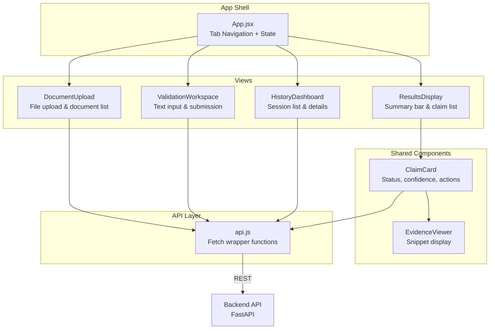
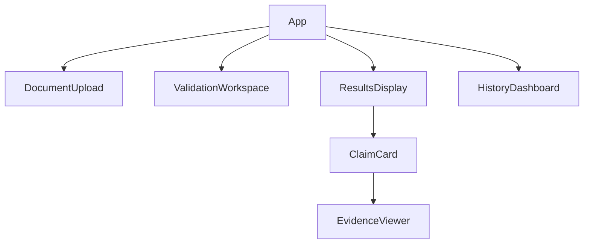
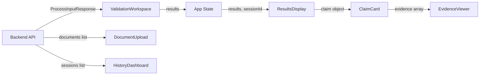
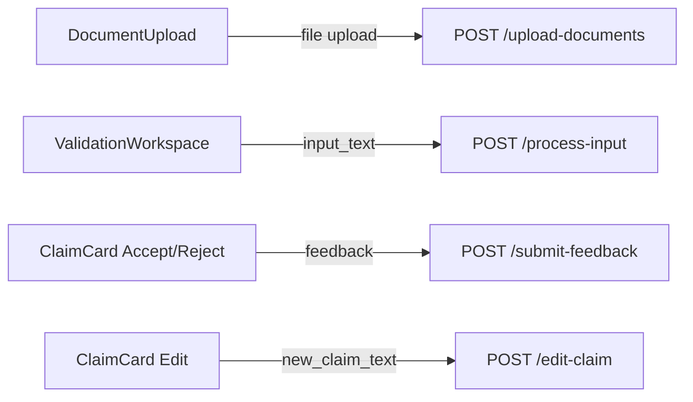

# Frontend — Structured Reasoning Interface

> The EviLearn frontend is a **structured reasoning interface**, NOT a chatbot UI. It displays decomposed claims, evidence snippets, confidence scores, and verification statuses. Every piece of information is traceable and actionable.

## Overview

The frontend is a React single-page application built with Vite and Tailwind CSS. It provides three main views: a Validation Workspace for submitting text, a Documents view for managing the knowledge base, and a History Dashboard for reviewing past sessions. All data is fetched from the FastAPI backend via a REST API client.

## Technology

| Component | Technology | Version | Purpose |
|-----------|-----------|---------|---------|
| Framework | React | 19.x | UI component library |
| Build Tool | Vite | 8.x | Dev server, HMR, production bundling |
| CSS | Tailwind CSS | 4.x | Utility-first styling |
| HTTP Client | Fetch API | Built-in | REST API communication |
| Linting | ESLint | 9.x | Code quality |

## Architecture



## Component Hierarchy



## Components

### App (`App.jsx`)

The root component managing tab navigation and global state.

| State | Type | Purpose |
|-------|------|---------|
| `activeTab` | `string` | Current view: `workspace`, `documents`, or `history` |
| `results` | `object \| null` | Latest validation results from pipeline |
| `sessionId` | `string \| null` | Current session ID for feedback |

**Navigation tabs:**
- **Validation Workspace** (default) — Input text and view results
- **Documents** — Upload and manage knowledge base files
- **History** — Browse past validation sessions

**Data flow:**
- `handleResults(data)` — Called by `ValidationWorkspace` on successful validation; sets `results` and `sessionId`
- `results` and `sessionId` are passed down to `ResultsDisplay`

---

### DocumentUpload (`components/DocumentUpload.jsx`)

File upload interface with document list display.

| State | Type | Purpose |
|-------|------|---------|
| `documents` | `array` | List of uploaded documents |
| `uploading` | `boolean` | Upload in progress |
| `error` | `string` | Error message |
| `success` | `string` | Success message |

**Behavior:**
1. On mount, fetches document list via `getDocuments()`.
2. File input accepts `.pdf` and `.txt` files.
3. On file selection, calls `uploadDocument(file)`.
4. Displays processing spinner during upload.
5. On success, shows success message and refreshes document list.
6. On error, shows error message from API.

**Document status colors:**
| Status | Color |
|--------|-------|
| `ready` | Green (`bg-green-100 text-green-800`) |
| `processing` | Yellow (`bg-yellow-100 text-yellow-800`) |
| `failed` | Red (`bg-red-100 text-red-800`) |

---

### ValidationWorkspace (`components/ValidationWorkspace.jsx`)

Text input form for submitting content to the validation pipeline.

| State | Type | Purpose |
|-------|------|---------|
| `inputText` | `string` | User's input text |
| `processing` | `boolean` | Validation in progress |
| `error` | `string` | Error message |

**Behavior:**
1. Textarea for entering answers, summaries, or explanations.
2. "Validate" button triggers `processInput(inputText)`.
3. Button is disabled when `processing` or input is empty.
4. On success, calls `onResults(result)` callback to parent.
5. On error, displays error message.

**Props:**
| Prop | Type | Description |
|------|------|-------------|
| `onResults` | `function` | Callback receiving `ProcessInputResponse` |

---

### ResultsDisplay (`components/ResultsDisplay.jsx`)

Displays validation results with a summary bar and list of claim cards.

**Props:**
| Prop | Type | Description |
|------|------|-------------|
| `results` | `object` | `ProcessInputResponse` from backend |
| `sessionId` | `string` | Current session ID |

**Summary bar** shows counts of each status type:
- 🟢 **Supported** count
- 🟡 **Weak** count (weakly_supported)
- 🔴 **Unsupported** count

**Empty state:** If no claims, displays the response message or "No claims were extracted from the input."

---

### ClaimCard (`components/ClaimCard.jsx`)

Interactive card for a single verified claim with status, confidence, evidence toggle, and feedback actions.

| State | Type | Purpose |
|-------|------|---------|
| `feedback` | `string \| null` | User's feedback decision (`accept`/`reject`) |
| `editing` | `boolean` | Edit mode active |
| `editText` | `string` | Edited claim text |
| `showEvidence` | `boolean` | Evidence panel visible |
| `error` | `string` | Error message |

**Props:**
| Prop | Type | Description |
|------|------|-------------|
| `claim` | `object` | Claim result object |
| `index` | `number` | Display index (1-based) |
| `sessionId` | `string` | Session ID for feedback/edit API calls |

**Status representation:**

| Status | Background | Badge | Icon | Label |
|--------|-----------|-------|------|-------|
| `supported` | Green (`bg-green-50`) | `bg-green-100 text-green-800` | ✓ | Supported |
| `weakly_supported` | Yellow (`bg-yellow-50`) | `bg-yellow-100 text-yellow-800` | ~ | Weakly Supported |
| `unsupported` | Red (`bg-red-50`) | `bg-red-100 text-red-800` | ✗ | Unsupported |

**Confidence display:** Circular progress ring showing `confidence_score × 100` as a percentage.

**Actions:**
| Action | API Call | Behavior |
|--------|----------|----------|
| Accept | `submitFeedback(claim_id, session_id, "accept")` | Shows "✓ Accepted" badge, disables buttons |
| Reject | `submitFeedback(claim_id, session_id, "reject")` | Shows "✗ Rejected" badge, disables buttons |
| Edit | — | Opens textarea with current claim text |
| Re-validate | `editClaim(claim_id, session_id, new_text)` | Submits edited text for re-validation |
| View Evidence | — | Toggles `EvidenceViewer` visibility |

---

### EvidenceViewer (`components/EvidenceViewer.jsx`)

Displays evidence snippets supporting or contradicting a claim.

**Props:**
| Prop | Type | Description |
|------|------|-------------|
| `evidence` | `array` | List of `{snippet, page_number}` objects |

**Display:** Each evidence item shows:
- Document icon
- Page number badge (e.g., "Page 12")
- Snippet text

**Empty state:** "No evidence available." (italic text)

---

### HistoryDashboard (`components/HistoryDashboard.jsx`)

Browsable list of past validation sessions with expandable results.

| State | Type | Purpose |
|-------|------|---------|
| `sessions` | `array` | List of session objects from API |
| `loading` | `boolean` | Initial data loading |
| `selectedSession` | `string \| null` | Currently expanded session ID |

**Behavior:**
1. On mount, fetches history via `getHistory()`.
2. Displays loading spinner while fetching.
3. Each session row shows:
   - Truncated input text
   - Timestamp and claim count
   - Status count badges (green ✓, yellow ~, red ✗)
4. Clicking a session expands it to show individual claim results.
5. Expanded view shows claim text, status badge, confidence %, and explanation.
6. Clicking again collapses the session.

**Empty state:** "No validation history yet. Submit text for validation to start building your history."

## API Client (`api.js`)

All API calls go through `/api` prefix, which Vite proxies to `http://localhost:8000` in development.

| Function | Method | Path | Request Body | Response |
|----------|--------|------|-------------|----------|
| `uploadDocument(file)` | POST | `/api/upload-documents` | `FormData` with file | `DocumentResponse` |
| `getDocuments()` | GET | `/api/documents` | — | `{documents: [...]}` |
| `processInput(inputText)` | POST | `/api/process-input` | `{input_text}` | `ProcessInputResponse` |
| `getResults(sessionId)` | GET | `/api/get-results/{sessionId}` | — | Session results |
| `submitFeedback(claimId, sessionId, decision)` | POST | `/api/submit-feedback` | `{claim_id, session_id, decision}` | `FeedbackResponse` |
| `editClaim(claimId, sessionId, newClaimText)` | POST | `/api/edit-claim` | `{claim_id, session_id, new_claim_text}` | `ProcessInputResponse` |
| `getHistory()` | GET | `/api/history` | — | `{sessions: [...]}` |

**Error handling pattern:** All functions check `res.ok`. On failure, they attempt to parse the error body for `detail`, falling back to a generic message. Errors are thrown as `Error` objects.

## Data Flow

### Incoming (Backend → Frontend)



### Outgoing (Frontend → Backend)



## Error Handling

| Scenario | Component | User-Facing Behavior |
|----------|-----------|---------------------|
| Upload fails | DocumentUpload | Red error banner with API error message |
| Unsupported file type | DocumentUpload | Red error banner with allowed types |
| Empty input submission | ValidationWorkspace | "Please enter text to validate." |
| Validation pipeline fails | ValidationWorkspace | Red error banner with API error message |
| No documents uploaded | ValidationWorkspace | Error from backend: "No knowledge base available" |
| No claims extracted | ResultsDisplay | Shows message: "No claims were extracted from the input." |
| Feedback submission fails | ClaimCard | Red error text below the card |
| Edit/re-validate fails | ClaimCard | Red error text below the card |
| History fetch fails | HistoryDashboard | Fails silently (empty state shown) |
| Document list fetch fails | DocumentUpload | Fails silently (empty list shown) |

## Dev Server Configuration

Vite is configured with an API proxy in `vite.config.js`:

```javascript
server: {
  proxy: {
    '/api': {
      target: 'http://localhost:8000',
      changeOrigin: true,
      rewrite: (path) => path.replace(/^\/api/, ''),
    },
  },
},
```

This rewrites `/api/process-input` → `http://localhost:8000/process-input`.

## Setup & Development

```bash
cd frontend
npm install
npm run dev        # Start dev server on http://localhost:5173
npm run build      # Production build → dist/
npm run preview    # Preview production build
npm run lint       # Run ESLint
```

## Limitations

- **No loading progress indicator during validation.** Users see a spinner but no stage-by-stage progress.
- **No client-side caching.** Document lists and history are re-fetched on every tab switch.
- **No file drag-and-drop.** Only click-to-upload is supported.
- **No claim re-ordering or filtering.** Claims are displayed in extraction order.
- **No document deletion UI.** Documents can only be added.
- **No responsive mobile layout optimizations** beyond Tailwind's default responsive utilities.
- **No dark mode.** Light theme only.
- **No pagination** on history or document lists.
- **Feedback is per-claim, per-session.** Users cannot undo feedback once submitted.
- **Edited claims create new results** rather than replacing existing ones.
